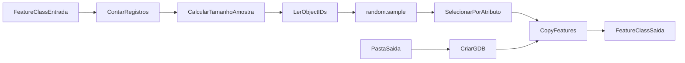

# Amostragem Aleatória Avançada

Toolbox Python (`.pyt`) para **ArcGIS Pro** que gera subconjuntos aleatórios de feições a partir de uma feature class existente.

A base de entrada **não é modificada**. A ferramenta sorteia os registros e exporta apenas a amostra para uma nova File Geodatabase (GDB).

## Requisitos

- ArcGIS Pro com `arcpy` disponível
- Python embutido do ArcGIS Pro (sem dependências externas — utiliza apenas `arcpy`, `random` e `os`)

## Instalação

1. Mantenha ou copie a pasta da toolbox no disco.
2. No ArcGIS Pro, abra o painel **Catálogo**.
3. Clique com o botão direito em **Toolboxes** → **Add Toolbox** (Adicionar Caixa de Ferramentas).
4. Selecione o arquivo `AmostragemAleatoriaAvancada.pyt`.
5. A toolbox aparecerá como **Amostragem Aleatória**, contendo a ferramenta **Criar Amostra Aleatória (fixo ou percentual)**.

## Ferramenta disponível

### Criar Amostra Aleatória (fixo ou percentual)

Cria uma amostra aleatória sem modificar a base original. Permite escolher número fixo ou percentual e gera uma GDB de saída.

| Parâmetro | Tipo | Obrigatório | Descrição |
|-----------|------|:-----------:|-----------|
| Feature class de entrada | Feature Class | Sim | Base de dados a amostrar |
| Tipo de amostragem | Lista | Sim | `Número fixo` ou `Percentual` |
| Valor da amostra | Número (Double) | Sim | Quantidade fixa ou percentual (0–100) |
| Pasta de saída | Pasta | Sim | Local onde a GDB será criada |
| Nome da Geodatabase | Texto | Sim | Nome da GDB (sem a extensão `.gdb`) |
| Nome da feature class de saída | Texto | Sim | Nome da feature class resultante dentro da GDB |
| Seed aleatória | Inteiro | Não | Semente para resultados reproduzíveis |

## Como funciona



Fluxo de execução:

1. Define `arcpy.env.overwriteOutput = True`.
2. Aplica `random.seed()` se a seed opcional for informada.
3. Conta o total de registros com `GetCount_management`.
4. Calcula o tamanho da amostra:
   - **Número fixo**: converte o valor informado para inteiro.
   - **Percentual**: `int(total * (valor / 100))`.
5. Valida o tamanho calculado (maior que zero, menor ou igual ao total; percentual entre 0 e 100).
6. Cria a GDB em `{pasta}/{nome}.gdb` se ela ainda não existir.
7. Lê todos os ObjectIDs da feature class de entrada via `SearchCursor`.
8. Sorteia os registros com `random.sample(oids, sample_size)` — amostragem **sem reposição**.
9. Seleciona as feições sorteadas em lotes de **999 OIDs** (limite do operador `IN` no SQL do ArcGIS).
10. Exporta a seleção com `CopyFeatures_management` para a feature class de saída.

## Exemplos de uso

### Amostra com número fixo

| Parâmetro | Valor |
|-----------|-------|
| Feature class de entrada | `C:\dados\base.gdb\parcelas` |
| Tipo de amostragem | Número fixo |
| Valor da amostra | `500` |
| Pasta de saída | `C:\dados\saida` |
| Nome da Geodatabase | `amostra_parcelas` |
| Nome da feature class de saída | `parcelas_amostra_500` |

Resultado: 500 feições sorteadas aleatoriamente de uma base com 10.000 registros, salvas em `C:\dados\saida\amostra_parcelas.gdb\parcelas_amostra_500`.

### Amostra percentual

| Parâmetro | Valor |
|-----------|-------|
| Feature class de entrada | `C:\dados\base.gdb\parcelas` |
| Tipo de amostragem | Percentual |
| Valor da amostra | `10` |
| Pasta de saída | `C:\dados\saida` |
| Nome da Geodatabase | `amostra_parcelas` |
| Nome da feature class de saída | `parcelas_amostra_10pct` |

Resultado: 10% da base — em uma camada com 10.000 registros, a amostra terá 1.000 feições (`int(10000 * 0.10)`).

### Amostra reproduzível (com seed)

Informe um valor inteiro no parâmetro **Seed aleatória** (por exemplo, `12345`) para obter o mesmo sorteio em execuções repetidas com os mesmos parâmetros.

## Mensagens de geoprocessamento

Durante a execução, a ferramenta exibe mensagens no painel de geoprocessamento:

- `Seed utilizada: {valor}` — quando a seed opcional é informada
- `Total de registros na base: {total}`
- `Tamanho final da amostra: {sample_size}`
- `Lendo ObjectIDs...`
- `Sorteando registros aleatoriamente...`
- `Aplicando seleção...`
- `Criando feature class de saída...`
- `Amostragem concluída com sucesso`

## Validações e erros

A ferramenta interrompe a execução com `ExecuteError` nas seguintes situações:

| Mensagem | Causa |
|----------|-------|
| `Percentual deve estar entre 0 e 100.` | Valor percentual fora do intervalo permitido |
| `O tamanho da amostra é inválido.` | Tamanho calculado menor ou igual a zero |
| `O tamanho da amostra é maior que o total de registros.` | Número fixo informado excede o total de feições |

## Limitações conhecidas

- **Execução em primeiro plano** — `canRunInBackground = False`; a ferramenta não roda em segundo plano.
- **Amostragem sem reposição** — cada feição pode ser selecionada no máximo uma vez.
- **Truncamento no percentual** — o tamanho é calculado com `int()`, sem arredondamento.
- **Uso de memória** — todos os ObjectIDs são carregados em memória antes do sorteio; camadas muito grandes podem demandar mais RAM.
- **Seleção em lotes** — a seleção por atributo é feita em chunks de 999 OIDs devido ao limite do operador `IN` no SQL do ArcGIS.

## Estrutura do projeto

```
Toolbox_amostragem/
├── AmostragemAleatoriaAvancada.pyt
└── README.md
```

## Autor

Desenvolvido por **Pery Monteiro** para uso no ArcGIS Pro.
